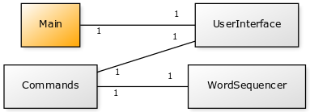

# Fastreader

### Aihe

#### Nopealukuohjelma

Ohjelman tarkoituksena on auttaa käyttäjää lukemaan syöttämä teksti tavallista nopeammin näyttämällä teksti sana kerralla jopa 500 sanaa/min nopeudella. Tämä auttaa sekä keskittymään tekstin sisältöön, että nopeuttaa tekstin lukua. 

Ohjelma tulee tarjoamaan:
* esittelykierroksen (tutorial) 
* huippunopeuden valitsimen 
* vaikeiden sanojen merkitsemisen 
* pikanäppäimet pysäyttämiselle, taakse- ja eteenpäin 
* tilastotietoa käyttäjästä, kuten luettujen sanojen määrä, tehtyjen taukojen määrä ja esim. useimmiten luettujen sanojen määrä

### Käyttäjät

Käyttäjä (lukija)

#### Lukijan toiminnot

* Tekstin tai tiedoston syöttäminen
* Nopeuden valitseminen
* Tekstiluvun pysäyttäminen
* Sanoissa eteen/taakse siirtyminen
  * Jos tekstinluku on käynnissa, se pysäytetään
* Tilastojen tarkastelu

### Luokkakaavio

### Mukavia lukuhetkiä!
